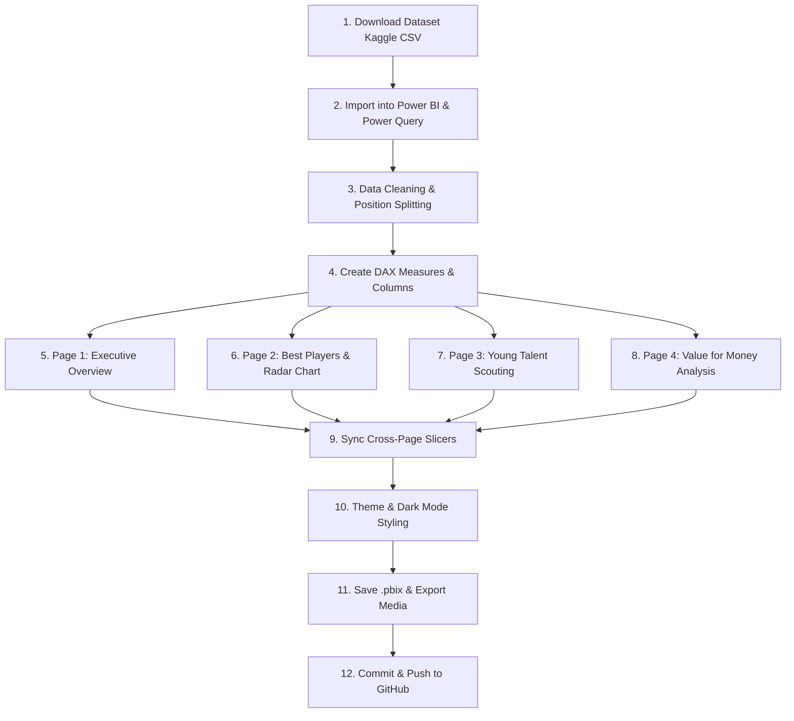

<div align="center">

# ⚽ FIFA Player Scouting Dashboard
### 🚀 Interactive & Animated Power BI Implementation Guide


[](https://powerbi.microsoft.com)
[](#)
[](#)
[](#)

*This guide walks through **exactly how to build** the Power BI Scouting Dashboard — every click, formula, and visual setting.*

</div>

---

## 📽️ Dashboard Visual Demo

> [!TIP]
> The animated preview above demonstrates the layout of the 4-page scouting dashboard: **Executive Overview**, **Player Directory**, **Hidden Gems Scouting Zone**, and **Value for Money Matrix**.

---

## ⚡ Implementation Workflow Diagram



---

## 📋 Step-by-Step Implementation Steps

> [!IMPORTANT]
> Make sure Power BI Desktop is updated to the latest version for best performance and visual compatibility.

---

### Step 1: Download the Dataset from Kaggle

1. Go to [kaggle.com](https://www.kaggle.com) and create a free account if needed.
2. Search for **"FIFA complete player dataset"** or user `stefanoleone992` (FIFA 22/23 player attributes).
3. Click **Download** to get the `.zip` archive.
4. Extract `players_22.csv` into your project folder (`c:\Users\vaibh\Desktop\data\FIFA\players_22.csv`).

---

### Step 2: Import Data into Power BI

1. Open **Power BI Desktop**.
2. Click **Home → Get Data → Text/CSV**.
3. Select your CSV file and click **Open**.
4. Click **Transform Data** (opens Power Query Editor).

---

### Step 3: Clean Data in Power Query

<details open>
<summary><b>▶ Click to Expand Power Query Transformations</b></summary>

- **3.1 Remove unnecessary columns:** Delete `player_url`, `long_name`, `player_face_url`, `club_logo_url`, `player_tags`.
- **3.2 Data Types:** Set `age`, `overall`, `potential` → **Whole Number**; `value_eur`, `wage_eur` → **Decimal Number**.
- **3.3 Missing Values:** Replace `null` in `club_name` with `"Free Agent"`. Remove blank rows in `overall`.
- **3.4 Primary Position Column:** Split `player_positions` by comma `,` to isolate the main position into `primary_position`.
- **3.5 Remove Duplicates:** Select `sofifa_id` → **Remove Duplicates**.
- **3.6 Apply and Close:** Click **Home → Close & Apply**.

</details>

---

### Step 4: Create Calculated Columns and Measures (DAX)

<details open>
<summary><b>▶ 💡 Click to Expand All DAX Formulas</b></summary>

#### Position Group (New Column)
```dax
Position Group =
SWITCH(
    TRUE(),
    Players[primary_position] = "GK", "Goalkeeper",
    Players[primary_position] IN {"CB","LB","RB","LWB","RWB"}, "Defender",
    Players[primary_position] IN {"CDM","CM","CAM","LM","RM"}, "Midfielder",
    "Attacker"
)
```

#### Age Bucket (New Column)
```dax
Age Bucket =
SWITCH(
    TRUE(),
    Players[age] <= 21, "U21",
    Players[age] <= 25, "21-25",
    Players[age] <= 30, "26-30",
    "30+"
)
```

#### Growth Potential (New Column)
```dax
Growth Potential = Players[potential] - Players[overall]
```

#### Hidden Gem Flag (New Column)
```dax
Hidden Gem Flag =
IF(Players[Growth Potential] >= 8 && Players[age] <= 23, "Hidden Gem", "Regular")
```

#### Value for Money (New Measure)
```dax
Value for Money = DIVIDE(AVERAGE(Players[overall]), AVERAGE(Players[value_eur]) / 1000000, 0)
```

#### KPI Measures
```dax
Avg Overall Rating = AVERAGE(Players[overall])
Avg Age = AVERAGE(Players[age])
Total Players = COUNTROWS(Players)
Total Clubs = DISTINCTCOUNT(Players[club_name])
Total Nationalities = DISTINCTCOUNT(Players[nationality_name])
```

</details>

---

### Step 5: Build Page 1 — Overview
1. Rename Page 1 to `Overview`.
2. Insert 4 **Card** visuals (`Total Players`, `Avg Overall Rating`, `Avg Age`, `Total Clubs`).
3. Add **Clustered Bar Chart** for Top 10 Nationalities (`nationality_name` vs `Total Players`).
4. Add **Donut Chart** for `Position Group` distribution.

---

### Step 6: Build Page 2 — Best Players
1. Create page `Best Players`.
2. Add **Table Visual** (`short_name`, `club_name`, `overall`, `potential`, `age`, `primary_position`).
3. Add **Slicers** for `Position Group`, `club_name`, and `nationality_name`.
4. Add **Radar/Spider Chart** for attribute comparison (Pace, Shooting, Passing, Dribbling, Defending, Physical).

---

### Step 7: Build Page 3 — Young Talent Scouting
1. Create page `Young Talent`.
2. Add **Scatter Chart** (X: `age`, Y: `potential`, Size: `overall`, Details: `short_name`).
3. Filter `Growth Potential >= 8` to isolate **Hidden Gems**.
4. Add Ranked Table of U23 players with highest growth potential.

---

### Step 8: Build Page 4 — Value for Money
1. Create page `Value for Money`.
2. Add **Scatter Chart** (X: `value_eur`, Y: `overall`).
3. Add Ranked Table of top players sorted by `Value for Money` score.

---

### Step 9: Sync Slicers Across Pages
1. Select any Slicer → **View → Sync Slicers**.
2. Enable **Sync** and **Visible** across all 4 pages.

---

### Step 10: Styling & Dark Theme
1. **View → Themes** → Choose Dark Theme / Football Green-Blue palette.
2. Format borders, card shadows, and title sizes.

---

### Step 11 & 12: Save & Push to GitHub
```bash
git add .
git commit -m "Add FIFA Scouting Dashboard with animated guide & web app"
git push origin main
```

---

## ✅ Final Completion Checklist

- [x] Dataset downloaded and cleaned with Python & Power Query
- [x] DAX calculated columns and KPI measures implemented
- [x] 4 interactive Power BI pages constructed
- [x] Web Scouting Application (`index.html`) created with live Chart.js charts
- [x] Animated WebP demonstration preview embedded into Markdown documentation
- [x] Clean GitHub README & step-by-step setup guides ready for push

