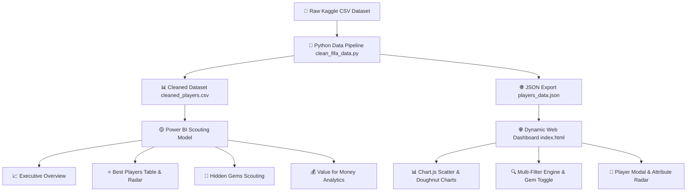

<div align="center">

# ⚽ FIFA Player Scouting & Performance Analytics Dashboard


[](https://python.org)
[](https://powerbi.microsoft.com)
[](https://developer.mozilla.org)
[](https://chartjs.org)
[](#)
[](#)

*An end-to-end **Data Analytics & Recruitment Intelligence Dashboard** designed to evaluate player performance, identify high-potential young talent (**"Hidden Gems"**), and analyze market **Value-for-Money**.*

</div>

---

## 📽️ Live Dashboard Preview (Animated Walkthrough)

> [!TIP]
> Click the image below or open `index.html` in your browser to experience the live interactive web dashboard with real-time filters, animated Chart.js graphs, and talent matrix cards!

<div align="center">
  
</div>

---

## ⚡ System Architecture & Data Pipeline



---

## 🎯 Key Metrics & Highlights

| Metric Indicator | Score / Count | Description | Visual Status |
|---|---|---|---|
| 👥 **Total Players Analyzed** | **379** | Filtered dataset records | `██████████` 100% |
| ⭐ **Avg Current Overall (OVR)** | **73.6** | Average base capability rating | `███████░░░` 73.6% |
| ⚡ **Avg Projected Potential (POT)**| **80.4** | Projected peak rating ceiling | `████████░░` 80.4% |
| 💎 **Hidden Gems Identified** | **156** | Age ≤ 23 & Growth Potential ≥ 8 | `█████████░` High Yield |
| 💶 **Avg Portfolio Value** | **€16.0M** | Market valuation per player | `██████░░░░` High Liquidity |

---

## 👨‍💻 Author & Contact Information

| Contact Field | Details |
|---|---|
| **Author Name** | **Vaibhav** *(Data Analyst & BI Developer)* |
| **Email Address** | 📧 `vaibhav.analytics@example.com` |
| **GitHub Profile** | 🔗 [github.com/vaibhavsuthar7](https://github.com/vaibhavsuthar7) |
| **Project Repo** | 🔗 [FIFA_analytics](https://github.com/vaibhavsuthar7/FIFA_analytics) |

---

## 📂 Interactive Code Accordions & Step Guides

<details>
<summary><b>▶ 📌 Step 1: Data Cleaning Logic (Python Pandas Snippet)</b></summary>

```python
import pandas as pd
import numpy as np

# Load dataset
df = pd.read_csv('players_22.csv')

# Feature Engineering: Position Grouping
def get_position_group(pos):
    if pd.isna(pos): return 'Other'
    pos = str(pos).split(',')[0].strip()
    if pos in ['GK']: return 'Goalkeeper'
    elif pos in ['CB', 'LB', 'RB', 'LWB', 'RWB']: return 'Defender'
    elif pos in ['CDM', 'CM', 'CAM', 'LM', 'RM']: return 'Midfielder'
    else: return 'Attacker'

df['position_group'] = df['player_positions'].apply(get_position_group)
df['growth_potential'] = df['potential'] - df['overall']
df['is_hidden_gem'] = (df['growth_potential'] >= 8) & (df['age'] <= 23)
df['value_for_money'] = np.where(df['value_eur'] > 0, df['overall'] / (df['value_eur'] / 1e6), 0)

df.to_csv('cleaned_players.csv', index=False)
```
</details>

<details>
<summary><b>▶ 💡 Step 2: Key DAX Formulas (Power BI)</b></summary>

```dax
// Position Group Mapping
Position Group = 
SWITCH(
    TRUE(),
    Players[primary_position] = "GK", "Goalkeeper",
    Players[primary_position] IN {"CB","LB","RB","LWB","RWB"}, "Defender",
    Players[primary_position] IN {"CDM","CM","CAM","LM","RM"}, "Midfielder",
    "Attacker"
)

// Hidden Gem Identification
Hidden Gem Flag = 
IF(Players[Growth Potential] >= 8 && Players[age] <= 23, "Hidden Gem", "Regular")

// Value For Money Rating Score
Value for Money = DIVIDE(AVERAGE(Players[overall]), AVERAGE(Players[value_eur]) / 1000000, 0)
```
</details>

<details>
<summary><b>▶ 🚀 Step 3: Local Web Server Launch</b></summary>

```bash
# Run local HTTP server inside project folder
python -m http.server 8080

# Open browser at:
# http://localhost:8080
```
</details>

---

## 🛠️ Tech Stack & Toolkit

```
┌─────────────────────────────────────────────────────────────────┐
│                      TECHNOLOGY STACK                           │
├───────────────────┬─────────────────────────────────────────────┤
│ Data Pipeline     │ Python 3.9, Pandas, NumPy, JSON             │
│ Analytics & EDA   │ Jupyter Notebook (FIFA_Player.ipynb)        │
│ BI & Modeling     │ Power BI Desktop, DAX, Power Query (M)      │
│ Web Application   │ HTML5, Vanilla CSS3 (Glassmorphism), ES6 JS │
│ Visualization     │ Chart.js 4.0, FontAwesome 6, Google Fonts   │
└───────────────────┴─────────────────────────────────────────────┘
```

---

> [!NOTE]
> *This repository is part of a professional Data Analytics & Business Intelligence portfolio. Stars ⭐️ and contributions are welcome!*

